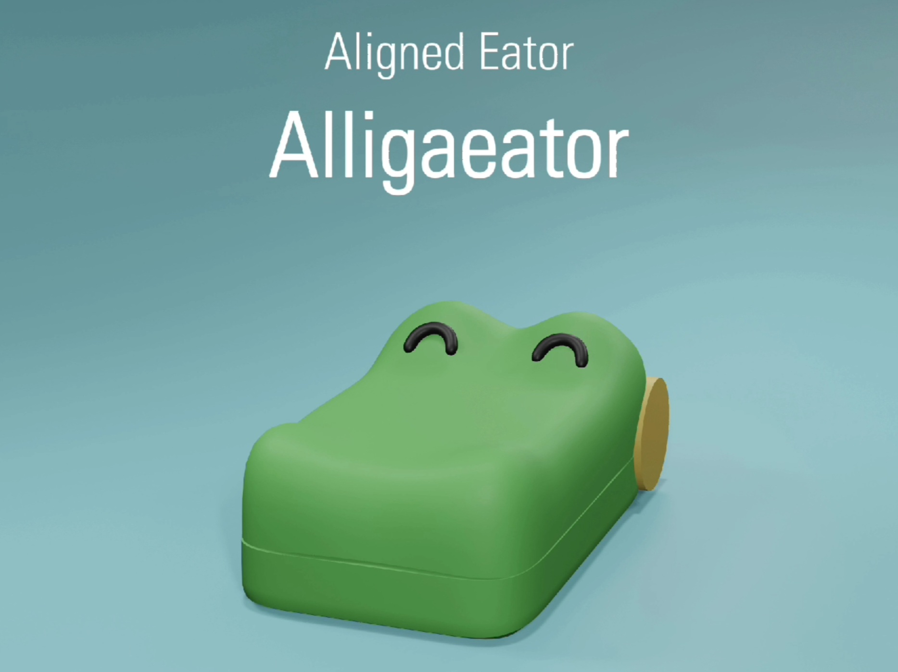
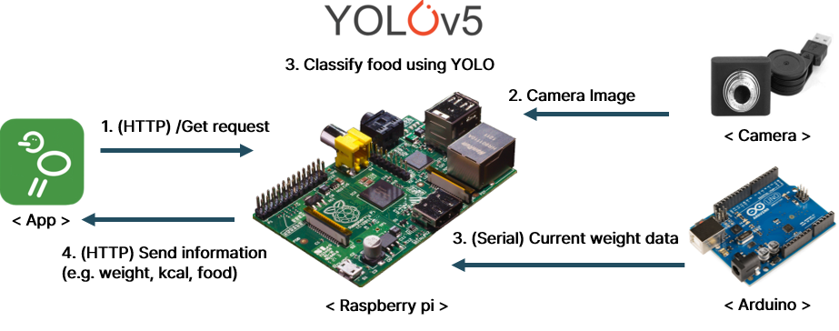
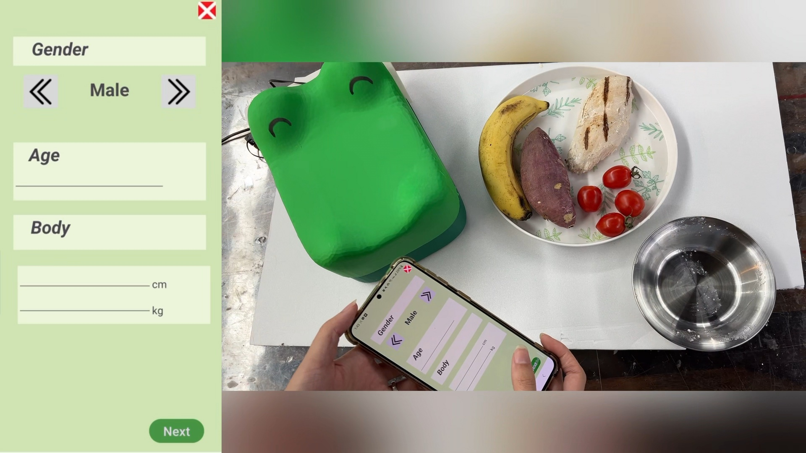

# Alligaeator
## Capstone Design Project Team 5

## Overview
We developed a calorie-measurement product that uses a weight sensor and a camera to identify food items, calculate calorie information accurately, and share the results with a companion mobile application.

## Implementation
- Trained a YOLOv5 model to classify each food item.
- Built the companion mobile application with Android Studio.
- Connected an Arduino with a load sensor to capture weight readings.
- Linked a webcam, Raspberry Pi, and Arduino to gather food type and weight data.
- Used HTTP communication between the Raspberry Pi and the application.

## Demo
Watch the final demo to see the full workflow in action.

